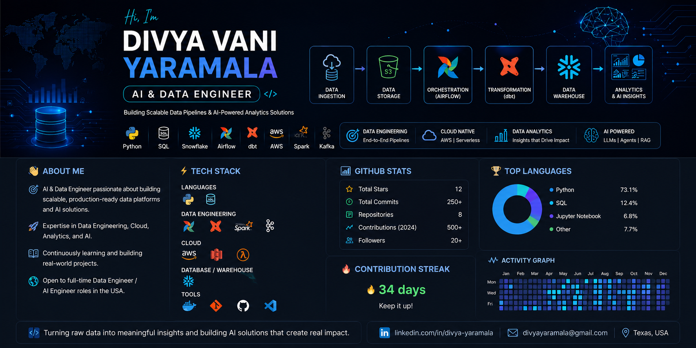

  

 
# Hi, I'm Divya Vani Yaramala 👋

  

### AI & Data Engineer | Python | SQL | Airflow | dbt | Snowflake | AWS

I build end-to-end data pipelines, cloud data platforms, and AI-powered analytics solutions.

## About Me

- Building production-style Data Engineering and AI projects
- Skilled in Python, SQL, Airflow, dbt, Snowflake, AWS, Spark, and Kafka
- Interested in AI Agents, LLMs, and cloud-native data platforms
- Open to full-time Data Engineer / AI Data Engineer roles

## 💻 Tech Stack

  

  
  
  
  
  

## 📊 GitHub Stats

  
  

  

  

## Featured Projects

### Stock AI Pipeline
AI-powered stock market data pipeline using Airflow, dbt, Snowflake, AWS, and LLM insights.

### Crypto Streaming Pipeline
Real-time crypto streaming pipeline using Kafka, Spark Streaming, AWS, and Snowflake.

## Connect With Me

LinkedIn: https://www.linkedin.com/in/divya-v-yaramala/?lipi=urn%3Ali%3Apage%3Ad_flagship3_profile_view_base_contact_details%3BOkAAkO86T1a80ljp%2BojndA%3D%3D
Email:divyavyaramala@gmail.com
-->
